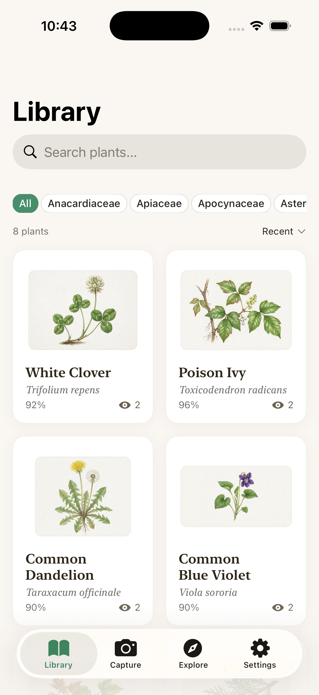
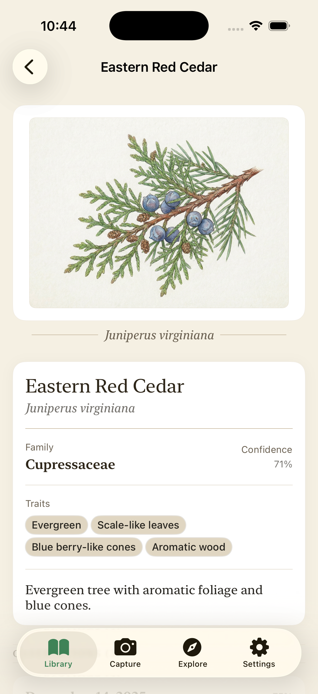
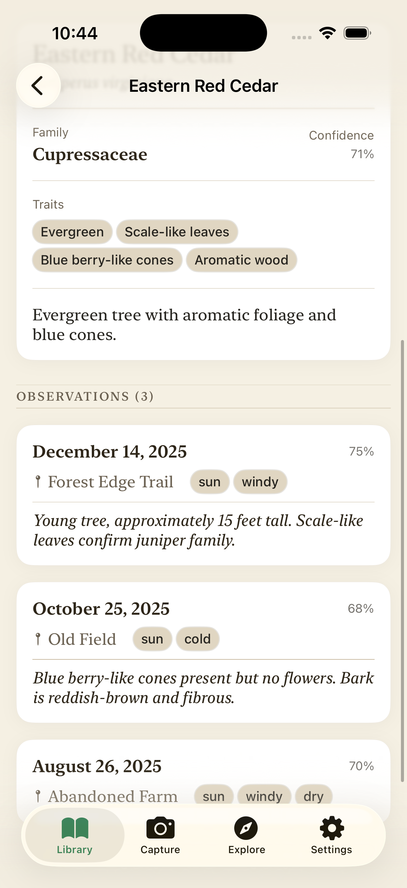

# Fieldnote

A beautiful iOS app for plant identification and field observations. Capture plants in the wild, identify them using machine learning, and keep detailed records of your botanical encounters.

## Screenshots

  
  
  
  

## Features

- **Plant Library** - Browse your collection of identified plants with beautiful botanical illustrations
- **ML-Powered Identification** - Identify plants from photos with confidence scores
- **Field Observations** - Record detailed observations including location, weather conditions, and notes
- **Plant Details** - View comprehensive information including scientific names, family classification, and plant traits

## Requirements

- iOS 15.0+
- Xcode 14.0+

## License

All rights reserved.
